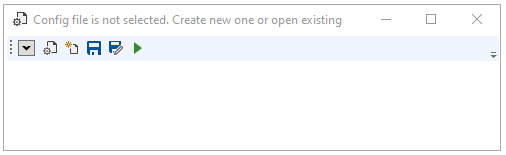
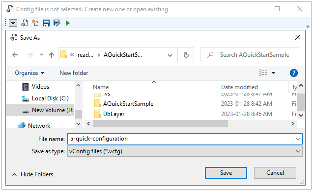
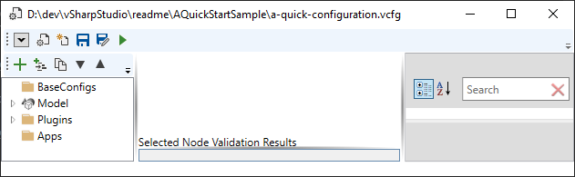
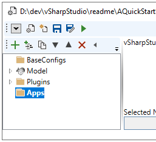
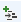
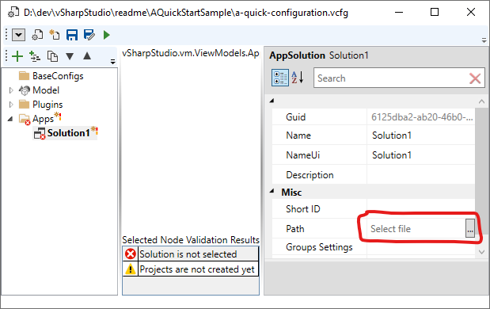
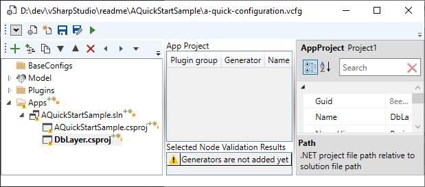

# Business model editor and code generator
## Installation

Download latest release [here](https://github.com/vladriabtsev/vSharpStudio/releases). 
Unzip content of downloaded file and run vSharpStudio.exe.

## Quick Start

### Create new Visual Studio solution

Create Visual Studio 'AQuickStartSample' solution with C# console 'AQuickStartSample' 
project and C# class library 'DbLayer' project.

.

For 'AQuickStartSample' project add reference to 'DbLayer' project.

### Setup vSharpStudio for code generation

Business model editor is storing model in a file with 'vcfg' extension.

Click create new configuration button .
Save as dialog will be opened to select folder for new configuration file.

Choose solution folder, enter file name for configuration, and click button Save to save it.

Inside business editor select node 'Apps'

Click insert child object  to create Solution object for model. 

Select solution file. Create child object of model solution for 'DbLayer' project.

### Model Editing and Code Generation

