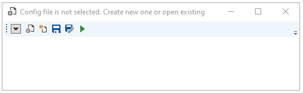
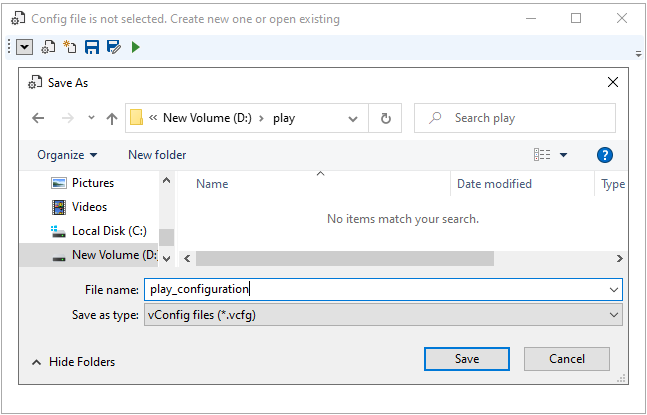
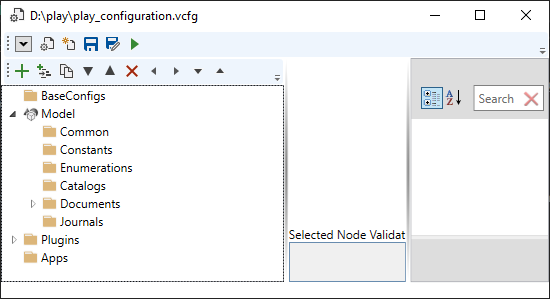

# vSharpStudio
## Installation

Download latest release [here](https://github.com/vladriabtsev/vSharpStudio/releases).

Unzip content of downloaded file and run vSharpStudio.exe.

## Quick Start

### Create new Visual Studio solution

Create Visual Studio solution in folder 'play' with two C# projects

### Setup vSharpStudio for code generation

Click create new configuration button .
Save as dialog will be opened to select folder for new configuration file.

Choose solution folder, enter file name for configuration, and click button Save to save it.

### Model Editing and Code Generation

