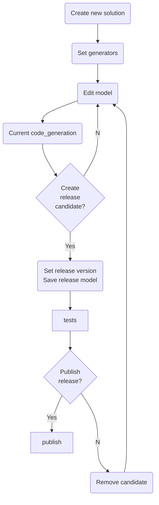

## Includable

public bool IsIncluded(string guidAppPrjGen, bool isFromPrevStable = false)

```mermaid
graph TB
    Start(Create new solution) --> generators(Set generators)
    generators --> edit(Edit model)
    edit --> code_generation(Current code_generation)
    code_generation --> candidate_decision{Create<br>release<br>candidate?}
    candidate_decision --No--> edit
    candidate_decision --Yes--> release_prep(Set release version <br> Save release model)
    release_prep --> tests
    tests --> publish_decision{Publish<br>release?}
    publish_decision --Yes--> publish
    publish_decision --No--> remove_candidate(Remove candidate)
    remove_candidate --> edit
```